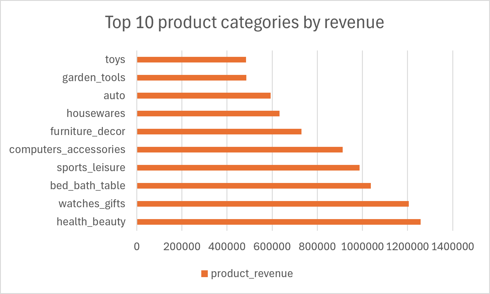
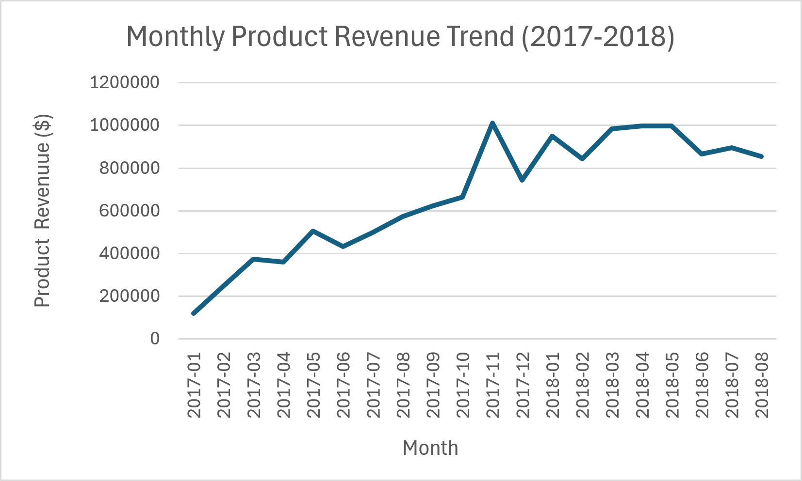
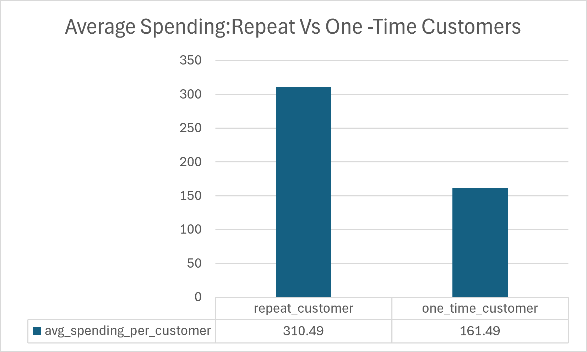
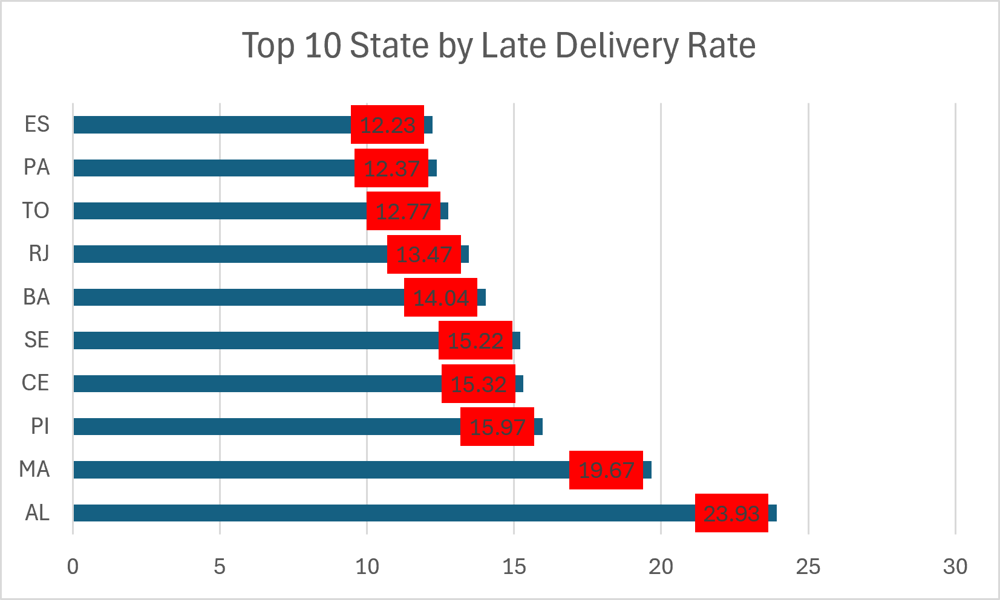
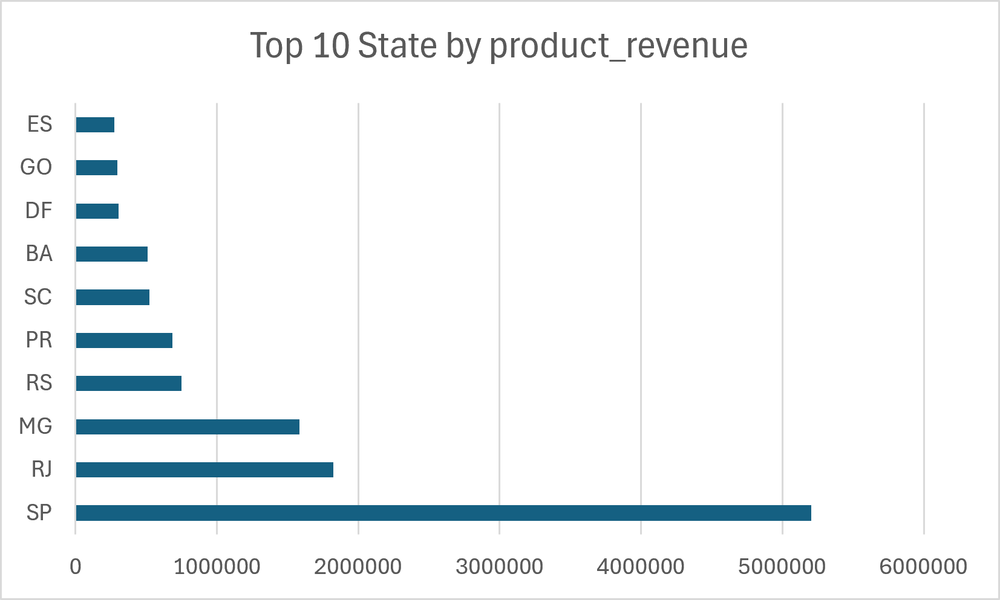

# Olist E-Commerce Business Analysis

## Project Overview

This project analyzes the Olist Brazilian E-Commerce dataset using PostgreSQL to identify revenue trends, customer behavior, product performance, geographic patterns, and delivery issues.

The goal is to transform raw e-commerce data into actionable business insights that can support management decision-making in areas such as product strategy, customer retention, regional growth, and logistics.

## Business Questions

The analysis addresses the following questions:

- Which product categories generate the most revenue?
- Which product categories are growing the fastest?
- How valuable are repeat customers compared with one-time customers?
- Which geographic markets generate the most revenue?
- Which regions have the highest average order values?
- Where are delivery delays most common?
- What business actions could improve revenue, retention, and customer experience?

## Tools & Skills

- PostgreSQL
- SQL
- DBeaver
- Excel
- Data Cleaning
- Exploratory Data Analysis (EDA)
- JOINs and CTEs
- Aggregate Functions
- Window Functions
- Conditional Aggregation
- Date Analysis
- Data Visualization
- Business Analysis
- Git & GitHub

## Dataset

The project uses the Olist Brazilian E-Commerce dataset, containing information about:

- Customers
- Orders
- Order items
- Products
- Sellers
- Payments
- Reviews
- Geographic locations

## Analysis Workflow

### 1. Data Setup
Imported and structured the raw Olist datasets in PostgreSQL for analysis.

### 2. Data Quality
Investigated missing values, duplicates, unmatched records, and other data-quality issues before performing business analysis.

### 3. Exploratory Analysis
Explored order activity, customers, products, revenue, geographic distribution, and other major characteristics of the dataset.

### 4. Business Analysis
Used SQL to investigate revenue performance, category growth, customer retention, geographic markets, and delivery performance.

### 5. Data Visualization
Created business-focused visualizations to communicate major findings, including revenue trends, product performance, customer value, geographic revenue, and delivery performance.

### 6. Business Insights
Translated SQL results into business findings and actionable recommendations.

## Key Findings

- Total product revenue was approximately **$13.59 million**.
- The top 10 product categories generated approximately **62.36%** of total product revenue.
- `health_beauty` was the largest revenue-generating product category.
- `watches_gifts` combined strong revenue with a relatively high average item price.
- Only approximately **3.12%** of unique customers placed more than one order.
- Repeat customers spent approximately **92% more per customer** than one-time customers.
- SP was the largest geographic market by revenue and order volume.
- Approximately **8.11%** of delivered orders with usable delivery information arrived late.
- RJ represents an important logistics opportunity because it combines large delivery volume with a relatively high late-delivery rate.

## Key Visualizations

### Top 10 Product Categories by Revenue



### Monthly Revenue Trend



### Repeat vs. One-Time Customer Value



### Top 10 States by Late Delivery Rate



### Top 10 States by Product Revenue


## Business Recommendations

1. **Improve customer retention** through loyalty programs, personalized offers, product recommendations, and re-engagement campaigns.
2. **Reduce late deliveries**, particularly in high-volume markets with elevated late-delivery rates.
3. **Protect high-performing categories** such as `health_beauty` and `watches_gifts` through inventory availability and targeted marketing.
4. **Evaluate regional opportunities** using both total market size and customer/order value.
5. **Monitor high-growth categories** for potential inventory and marketing investment.

## Repository Structure

```text
sql_business_analysis_project/
│
├── Data/
│
├── Sql/
│   ├── 01_data_setup.sql
│   ├── 02_data_quality.sql
│   ├── 03_exploratory_analysis.sql
│   └── 04_business_analysis.sql
│
├── visuals/
│   ├── top_categories_revenue.csv
│   ├── top_categories_revenue.png
│   ├── monthly_revenue_trend.csv
│   ├── monthly_revenue_trend.png
│   ├── repeat_customer_value.csv
│   ├── repeat_customer_value.png
│   ├── late_delivery_by_state.csv
│   ├── late_delivery_by_state.png
│   ├── top_states_by_revenue.csv
│   └── top_states_by_revenue.png
│
├── 05_business_insight.md
└── README.md

Data Notes
The dataset contains incomplete activity in late 2018. Year-over-year comparisons were therefore made using comparable January-August periods where appropriate.
Some orders do not have matching item-level records. Revenue and product analyses use records where the necessary order-item information is available.
Data-quality issues were investigated and documented rather than automatically removing records without understanding their impact on the analysis.
Author
Bikas Poudel
Computer Science (CIS) Student
Aspiring Data Analyst